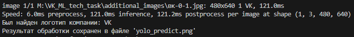
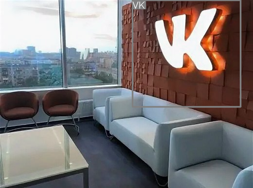
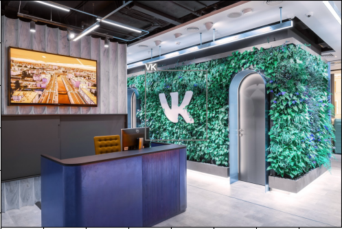
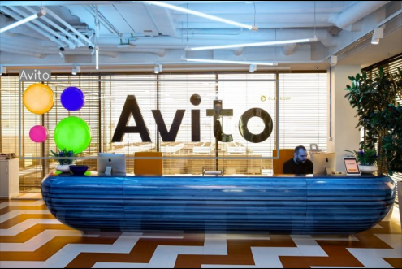

# Техническое задание на позицию ML Developer, 2025 год

Этот проект позволяет детектировать логотипы компаний VK и авито на изображениях с использованием предобученной модели YOLO11.


---

### Структура репозитория
```
VK_ML_tech_repo/
├───base_logos/ - логотипы некоторых компаний
│   ├───avito_logos/ - логотипы авито (использовались для обучения)
│   └───vk_logos/ - логотипы VK (использовались для обучения)
├───my_test_images/ - изображения для тестов
├───yolo_models/ - модели YOLO (предобученные)
├───logo_detect.py - основная программа
├───vk_logo.ipynb - Ноутбук с исходным кодом (подготовка данных, обучение, тесты)
...
```

---

## Как использовать
1. Клонируйте репозиторий:
    ```
    git clone <ДОБАВИТЬ URL РЕПЫ>
    ```

2. Создайте виртуальное окружение:
    ```
    python -m venv venv
    ```

3. Активируйте виртуальное окружение:
    На Windows:
    ```
    venv/Scripts/activate
    ```
    На macOS/Linux:
    ```
    source venv/bin/activate
    ```

4. Установите зависимости:
    ```
    pip install -r requirements.txt
    ```

5. Запустите приложение, через файл logo_detect.py, указав путь к изображению, на котором нужно искать логотипы компаний.
    ```
    python logo_detect.py <ПУТЬ К ИЗОБРАЖЕНИЮ>
    пример: python logo_detect.py my_test_images/scale_2400.jpeg
    ```
    Будет указано, какие компании были найдены, а также, будет создано изображение с разметкой, в виде bounding boxes.

---

## Примеры работы программы:









---

## Использованные данные:
Датасет LogoDet-3K с Kaggle (обучение базовой модели для поиска логотипов): https://www.kaggle.com/datasets/lyly99/logodet3k/data

Датасет COCO Small с Roboflow (использовал как фоновые изображения для синтетических данных с логотипами VK и авито): https://universe.roboflow.com/yolov8-6mvq3/coco-small-bzl29/dataset/2

---

Задание выполнял: Кирьянов Сергей, 2025 год.